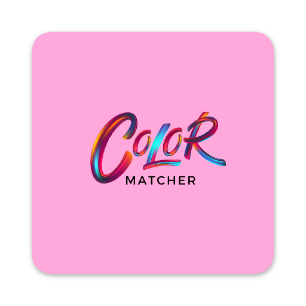
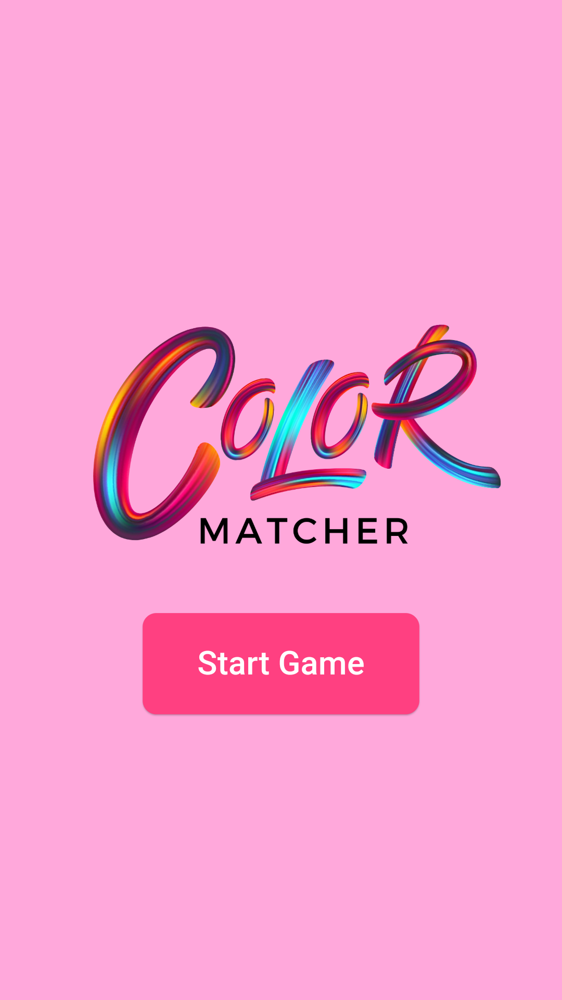
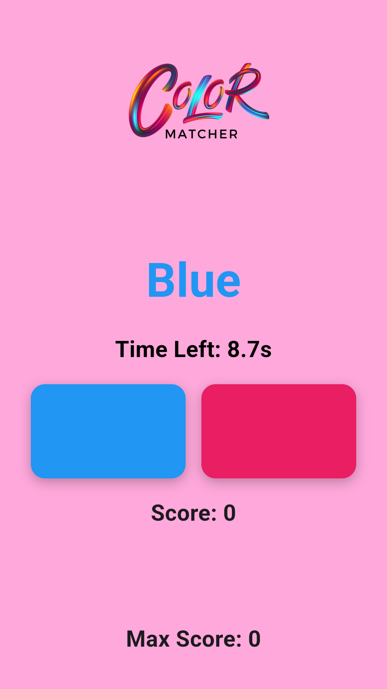

    

## About Me

Hi, I’m Ensar Duman – a visionary engineer passionate about crafting cutting-edge software solutions and driving impactful projects. With over 11 years of experience in software development, technical leadership, and project management, I bring a wealth of expertise to the table.

Throughout my career, I have successfully contributed to a diverse range of projects, from initial development to deployment, taking on roles as a hands-on developer and a strategic technical leader. My core strengths lie in .NET, Flutter, and React.js, but I’ve also proven my adaptability by mastering technologies like PHP, Python, and Django.

    
    

<!-- Put this code anywhere in the body of your page where you want the badge to show up. -->

     <a itemprop='url' href=https://www.fiverr.com/ensarduman rel="nofollow" target="_blank" style='display: inline-block;'>
        

        

            
ensarduman

            
Fiverr

            
Seller

            
Hi, I am Ensar Duman I am a software engineer with 11 years of experience in development technical leadership and project management I specialize in NET Flutter and Reactjs while also excelling in Python Django and PHP From initial development to deployment I have led diverse impactful projects as both a hands-on developer and strategic leader My passion lies in crafting innovative software solutions that deliver measurable results and drive meaningful impact

        

    </a>

## Color Matcher

**Short Description:** Match the color name to the correct block before time runs out! 🎨✨

**Full Description:** Test your reflexes and color recognition skills with Color Matcher! In this fast-paced game, you'll be shown the name of a color at the top of the screen, while two color blocks appear below. Click the correct color that matches the name, but be careful—the text color will try to trick you!

- Earn points for every correct choice.
- Lose points for wrong answers.
- The timer adds to the challenge—act quickly!

How high can you score before the time runs out? Play now and find out! 🎨✨

### Screenshots

### Download

